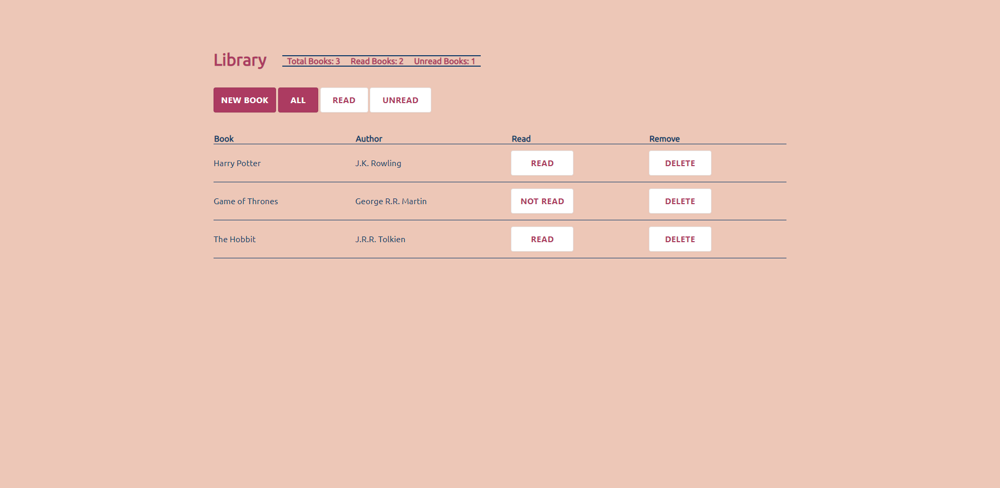

## Library 

- Live Demo: https://aidenm99.github.io/Library/

### The Project

- The aim of this project was to create a library where you can add, remove and update books

### Features

- Append books to a table along with details such as the book's title and author
- Statistics for the amount of read books, unread books and books in total
- Ability to change a book's 'read' status with the click of a button
- A filter to allow the user to see 'all', 'read' and 'unread' books
- Local storage 

